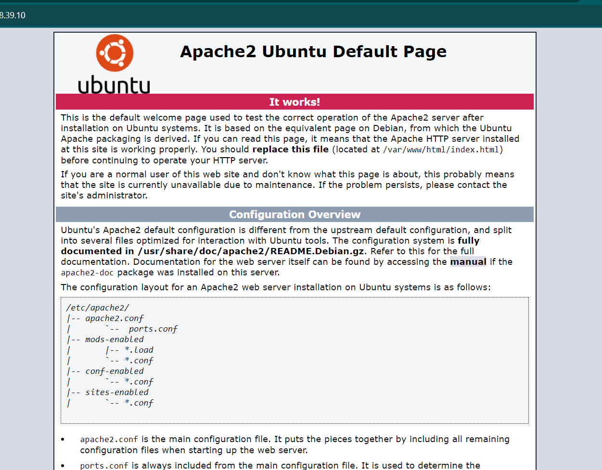
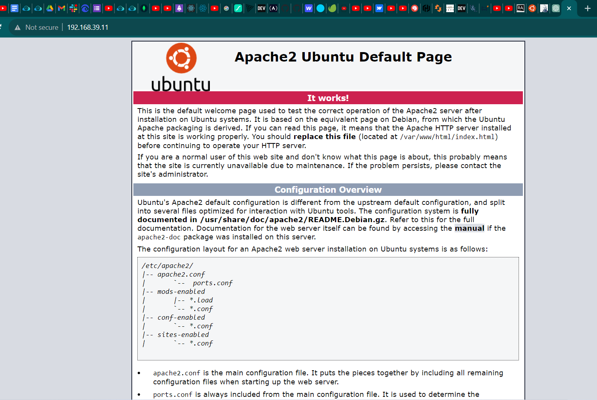

### Script Configuration for Master and Slave:

1. Master Machine Configuration:

    - Update and upgrade the machine.
    - Install a sudo user named "altschool."
    - Generate an SSH key for the user "altschool."
    - Transfer the SSH key of the "altschool" user to the slave machine, allowing only this user to SSH into the slave machine using a password.
    - Copy a file named "/mnt" from the "altschool" user to the slave machine.

2. LAMP Stack Installation (Master & Slave):

   LAMP (Linux, Apache, MySQL, and PHP) stack installation includes the following steps for both the master and slave:

    - Install the Apache2 web server.
    - Install PHP and its required dependencies.
    - Install MySQL.
    - Enable necessary modules.
    - Restart the Apache web server.

   Additionally, a LAMP stack will be installed on both the master and slave, and Apache will be restarted after the installation and configuration. MySQL server and client will also be installed on both the master and slave.

      

3. Master Machine Specification:

   - Machine name: master1
   - Operating System image: ubuntu/focal64
   - Network Configuration:
     - Private Network
     - Static IP address: "192.168.39.10"

4. Slave Machine Specification:

   - Machine name: slave1
   - Operating System image: ubuntu/focal64
   - Network Configuration:
     - Private Network
     - Static IP address: "192.168.39.11"

5. Slave Machine Configuration:

    - Update and upgrade the machine.
    - Install the following packages:
      - `sshpass`: Allows password input while logging in.
      - Enable password authentication for SSH.
      - Restart the SSH daemon service (sshd).
      - Install `avahi-daemon` and `libnss-mdns`.

6. PHP Versions and Permissions:

   Different versions of PHP will be installed, and the permissions for the "/var/www" directory will be set with an owner and group of "www-data:www-data."

     